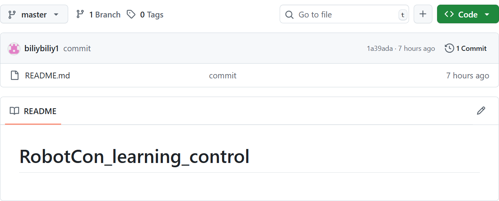

# RobotCon_learning_control
## Git和Github
1. 什么是Git、GitHub
   - Git 是一个开源的、分布式版本控制系统（Version Control System, VCS）。它的核心功能是跟踪文件的变更历史，帮助开发者高效管理代码版本。
    - GitHub 是一个基于 Git 的 代码托管平台。它提供了远程仓库存储、协作工具和社区功能，是全球最大的开源项目聚集地之一。
2. Git从初始化创建本地仓库到上传到GitHub的流程是什么   
   - 两个选择：
    1. 本地初始化Git仓库：
   ```bash
   git init
   git add
   git commit -m "Initial commit"
   ```
   2. 在GitHub上创建新仓库，获取远程地址（如<https://github.com/biliybiliy1/RobotCon_learning_control>）
   ```bash
   git remote add origin https://github.com/biliybiliy1/RobotCon_learning_control
   git push -u origin main
   ```
3. 如何创建新的分支
   - 两个选择
    1. 先创建另一个分支，再转进去
   ```bash
   git branch 新分支的名字
   git checkout 新分支的名字
   ```
   2. 一气呵成
   ```bash 
   git checkout -b 分支名字
   ```
4. 如何修改本地仓库的远程连接
    - 两个选择
    1. 修改
   ```bash
   git remote -v 
   git remote set-url origin [url]
   ```
   2. 先删原来的，再加新的
   ```bash
   git remote rm origin
   git remote add origin [url]
   ```
## MarkDown骚操作
* <font face='黑体' color=#ff0000 size=4>红</font><font face='黑体' color=#00ff00 size=4>绿</font><font face='黑体' color=#0000ff size=4>蓝</font>可以用
```HTML
<font face='黑体' color=#ff0000 size=4>红</font>
<font face='黑体' color=#00ff00 size=4>绿</font>
<font face='黑体' color=#0000ff size=4>蓝</font>
```
表示  
* 表格  
| 左对齐 | 居中对齐 | 右对齐 | 
| :----- | :------: | -----: |
| A      |   B      |      C |
* 图片
  

