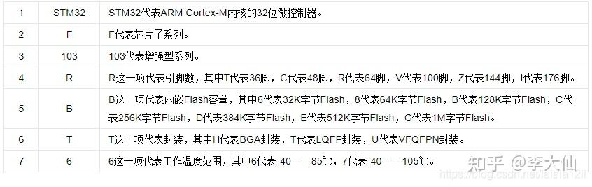
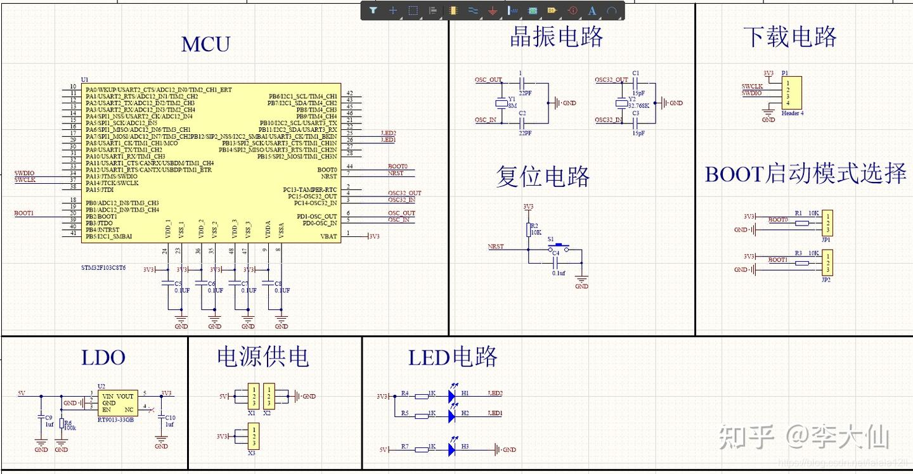

# 流水灯和蜂鸣器同时工作
- 任务描述  
  流水灯持续工作，在`keil`的`Watch`添加变量控制蜂鸣器发声次数，在蜂鸣器发生过程，流水灯不间断工作  
- 思路  
  1. 在debug窗口为`watch`变量赋值后，为了不打断流水灯的工作，需要在`set\reset`蜂鸣器所在引脚的同时，`set\reset`四颗LED
  2. 由于不知道`watch`变量具体值，依次点亮四颗LED的机制不能具体`set`某个引脚，而应该动态变化
  3. 点开`GPIO_PIN_x`的定义
      ```c
      #define GPIO_PIN_4  ((uint16_t)0x0010)      
      #define GPIO_PIN_5  ((uint16_t)0x0020)  
      #define GPIO_PIN_6  ((uint16_t)0x0040)  
      #define GPIO_PIN_7  ((uint16_t)0x0080)  
      #define GPIO_PIN_8  ((uint16_t)0x0100)
      ```  
        控制四颗LED的引脚满足$2^n$关系     
  4. 通过`pow(2, i % 4) * 0x0010`, 实现循环点亮LED

- 实现代码  
```c
uint8_t watch = 0;
uint8_t rank = 0;
while (1)
{
    EventStartA(10);

    if (watch)
    {
    for (int i = 0; i < watch; i++)
    {       
        uint16_t GPIOx = (uint16_t) pow(2, i % 4) * 0x0010;
        
        HAL_GPIO_WritePin(GPIOA, GPIO_PIN_8, GPIO_PIN_SET);
        HAL_GPIO_WritePin(GPIOA, GPIOx, GPIO_PIN_SET);
        HAL_Delay(100);
        HAL_GPIO_WritePin(GPIOA, GPIO_PIN_8, GPIO_PIN_RESET);
        HAL_Delay(400);
        HAL_GPIO_WritePin(GPIOA, GPIOx, GPIO_PIN_RESET);
        HAL_Delay(100);
    }
    rank = watch;
    watch = 0; 
    }
    for (int i = 0; i < 4; i++)
    {
        HAL_GPIO_WritePin(GPIOA, (uint16_t) pow(2, (rank + i) % 4) * 0x0010, GPIO_PIN_SET);
        HAL_Delay(500);	  
        HAL_GPIO_WritePin(GPIOA, (uint16_t) pow(2, (rank + i) % 4) * 0x0010, GPIO_PIN_RESET);
        HAL_Delay(100);	
    }
}
```
# Stm32基础知识
**单片机**：单片机是一种集成电路芯片
- Stm32系列：
  
  队里常用是STM32F405RGT6和STM32H723ZET6
- 单片机的最小系统
  1. 单片机
   单片机是一种集成电路芯片，又包含微处理器(cpu)、存储器(程序存储器ROM和数据存储器RAM)、输入\输出接口电路(I\O接口)
  2. 电源电路
   供电，为求稳定，往往又滤波电容
  3. 时钟电路
   单片机外接振荡器提供高频脉冲经过分频处理后，成为单片机内部时钟的信号，协调片内各部件。
  4. 复位电路  

- Stm32编程
  1. 早期主要以库函数和寄存器两种方式进行编程
  2. 后来推出了HAL库，降低门槛

   