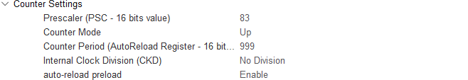

# 流水灯
- 初始化TIM3定时器，在CubeMX里面设置：  
  1. 查数据手册得，TIM3挂载在APB1总线
     
   并且，输出引脚为PA6&PA7，故而初始化这两个引脚为`TIM1_CH1`&`TIM1_CH2`
     
  2. 在CubeMax里设置使用内部时钟，由前面的时钟配置可以得到我们输入频率为84MHz
   
  3. 根据$fre_PWM = fre_clc / (Prescaler × Counter)$,设置CubeMax中的参数。由于寄存器从零开始,分频计数器本质上也是寄存器，故我们得参数要$-1$
  4. 生成代码后，在计时器初始化函数`MX_TIM3_Init()`之后，用`HAL_TIM_PWM_Start(&htim3, TIM_CHANNEL_1)`函数使能PWM输出,并可以用`__HAL_TIM_SetCompare(&htim3, TIM_CHANNEL_1, i)`调整占空比，duty(%) = i / (Period + 1) × 100%
  5. 为了实现呼与吸得效果，我们可以在循环中设置占空比，达到递增到递减循环效果

```c
MX_TIM3_Init();
HAL_TIM_PWM_Start(&htim3, TIM_CHANNEL_1);
while (1)
{
    for (int i = 0; i < 1000; i++)
    {
        __HAL_TIM_SetCompare(&htim3, TIM_CHANNEL_1, i);
        HAL_Delay(1);
    }
    for (int i = 0; i < 1000; i++)
    {
        __HAL_TIM_SetCompare(&htim3, TIM_CHANNEL_1, 1000-i);
        HAL_Delay(1);
    }
}
```

# 复用定时器实现不同延迟
- 定时器基础与前面相同，这里我设置的是每0.25s发生终端，由于是发生中断，故需要在CubeMax里使能中断
-  `HAL_TIM_PeriodElapsedCallback`是中断回调函数，发生中断时调用。因此，该函数每隔0.25s会调用一次
-  为了让流水灯快一点，我们每一次调用中断回调函数都会执行
    ```c
        HAL_GPIO_WritePin(GPIOA, (uint16_t) pow(2, rank % 4) * 0x0010, GPIO_PIN_SET);
        HAL_GPIO_WritePin(GPIOA, (uint16_t) pow(2, (rank + 3) % 4) * 0x0010, GPIO_PIN_RESET);
    ```  
    `rank % 4`与`(rank + 3) % 4`分别是循环取余出当前点亮的LED和熄灭的LED的GPIO引脚
- 我们设置全局变量`flag`,记录是否到1s，每次满1s,蜂鸣器发声并打印`ni hao`

```c
int flag = 0;
int rank = 0;
void HAL_TIM_PeriodElapsedCallback(TIM_HandleTypeDef *htim)
{
    if(htim->Instance == TIM1)  
    {
		HAL_GPIO_WritePin(GPIOA, GPIO_PIN_8, GPIO_PIN_RESET);
		HAL_GPIO_WritePin(GPIOA, (uint16_t) pow(2, rank % 4) * 0x0010, GPIO_PIN_SET);
		HAL_GPIO_WritePin(GPIOA, (uint16_t) pow(2, (rank + 3) % 4) * 0x0010, GPIO_PIN_RESET);
		if (flag == 4) 
		{
			printf("Ni Hao\n");
			flag = 0;
			HAL_GPIO_WritePin(GPIOA, GPIO_PIN_8, GPIO_PIN_SET);
		}
		else {flag++;}
		rank = (rank + 1) % 4;
    }
}
```