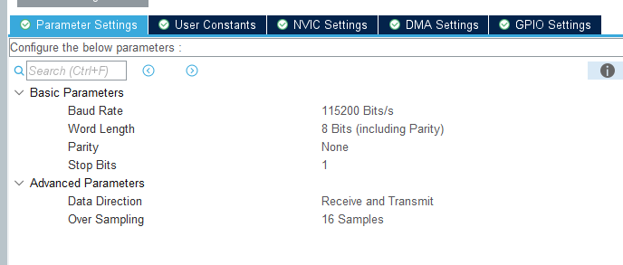

# Keil 奇奇怪怪的错误
- 调试大半晚上，怎么也没有发现代码有什么问题，玄之又玄的是，进入debug模式，就能正常跑，而正常编译跑就有问题
- 检查之后发现是新建工程后keil自动选择的三级编译优化，改为不优化后没有问题了
  
# 串口通讯——复读机
1. CubeMax设置：`Connectivity`->`USART1`->`mode`,选择`Asynchronous`异步通信模式，`Paramater Setting`如下：  
  
1. 
   ```c
   HAL_UART_Receive_IT(&huart1, &tmp, 1);
   ```  
   第一参数是`UART_HandleTypeDef *`，对应我们用的串口结构体地址；第二参数`uint8_t *`是我们接受信息后所存地址；第三参数是我们要存入的字节数；  
   上面设定接受1个字节，当我们接受1个字节后，就会进入我们覆盖的弱函数
    ```c
    void HAL_UART_RxCpltCallback(UART_HandleTypeDef *huart) 
    {
        if(huart->Instance == USART1)   
        {
            if (tmp != '\n')
            {
                buff[index] = tmp;
                index++;
            }
            else
            {
                HAL_UART_Transmit(&huart1, (uint8_t *) buff, index , 0xffff);
                index = 0;
            }
            HAL_UART_Receive_IT(&huart1, &tmp, 1);
        }
    }
    ```
    执行函数内部的内容，这里我们首先判断是不是串口1，然后判断存入字节是不是换行符，如果不是，就把接受的字节存入缓冲区。  
    当检查到有换行符，我们便将之前读进缓冲区的字节取出打印。
    最后，`HAL_UART_Receive_IT(&huart1, &tmp, 1);`是极其重要的一步，因为串口接受中断默认执行一次，如果不在回调函数重新使能，我们只能接受一次。
# 串口通讯——包头包尾解包
1. 我们定义包头`A5`,包尾`5A`,中间的前四字节是`int32_t`,后两位分别是一个`uint8_t`
2. 定义结构体用于解包：
   ```c
    typedef struct
    {
        int32_t a;
        uint8_t b[2];
    } pack;
    ```
3. 使用`case`构建状态机解包
```c
void HAL_UART_RxCpltCallback(UART_HandleTypeDef *huart) 
{
	if(huart->Instance == USART2)   
	{
		switch(state)
		{
			case 0: // 等待包头，读到包头后进入1状态
			if (tmp == 0xA5) state = 1;
			break;

			case 1: // 存入缓冲buf
			buf[flag] = tmp;
			flag = (flag + 1) % 6; // 循环取余防溢出
			if (!flag) state = 2; // 读完六字节进入下一状态
			break;

			case 2: // 等待包尾
			if (tmp == 0x5A)
			{
			memcpy(&mypack.a, buf, 4); // memcpy真好用
			mypack.b[0] = buf[4]; mypack.b[1] = buf[5];
			char str[16]; // 如果转换成字符串，输出打印都是乱码
			sprintf(str, "%ld\r\n", (long) mypack.a);
			HAL_UART_Transmit(&huart2, (uint8_t *) str, strlen(str) , 0xffff);
			sprintf(str, "%i\r\n", (int) mypack.b[0]);
			HAL_UART_Transmit(&huart2, (uint8_t *) str, strlen(str) , 0xffff);
			sprintf(str, "%i\r\n", (int) mypack.b[1]);
			HAL_UART_Transmit(&huart2, (uint8_t *) str, strlen(str) , 0xffff);
			}			
		}
		HAL_UART_Receive_IT(&huart2, &tmp, 1);
	}
}
```
# 串口通讯——搭配Vofa输出正弦
- 只要对`printf`重定向到vofa，便可以轻松输出想要的图案了
- `printf`最终会把需要输出的字符一个个送给`fputc`函数，我们编写`fputc`函数，重定向
```c
int fputc(int ch, FILE *f)
{
  HAL_UART_Transmit(&huart2, (unsigned char *)&ch, 1, 50);
  return ch;
}
```
- 打印正弦函数就很轻松了,换行符是必须的，不然vofa认不出来
```c
float t = 0;
while (1) 
{
    printf("%f\n", sin(t));
    t += 0.01;
    HAL_Delay(200);
}
```